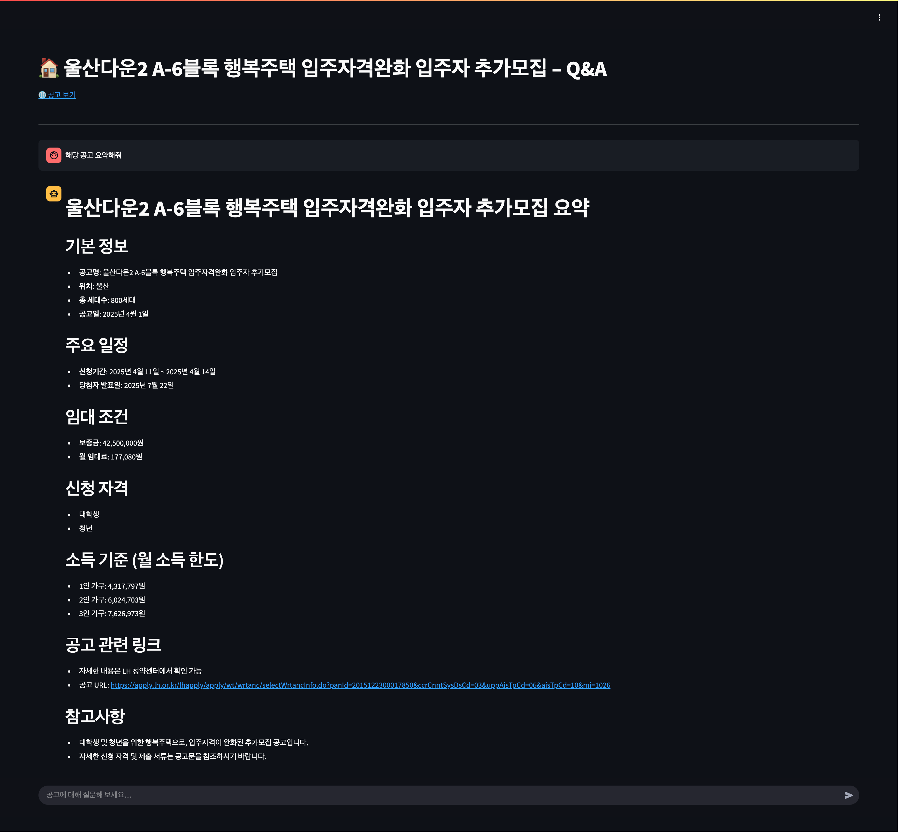
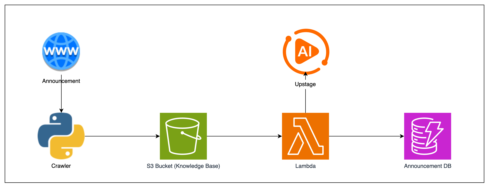
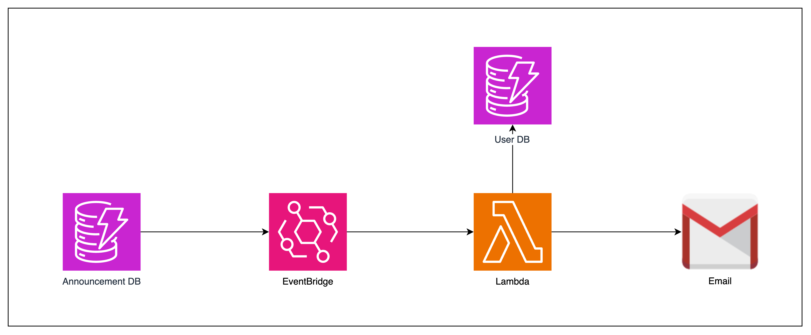
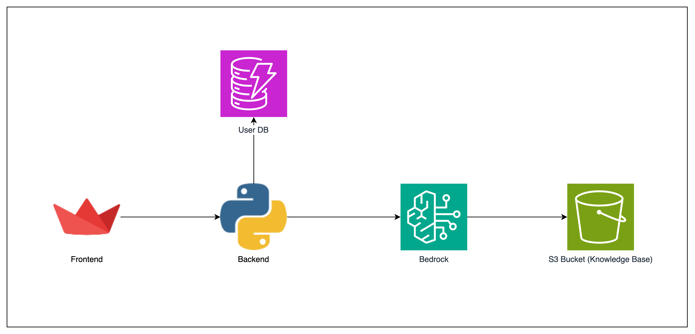

# 🏠 New Housing Drawing Notification AI

A smart notifier for youth housing applications.  
Get alerts only for the applications you're eligible for, and ask questions using GenAI Bedrock.

## 🖼️ Demo Image (User Input)


---

## 💬 Demo Image (Chatting)



---

## 🔄 Workflows

### 🤖 Crawling



### 🔔 Notification



### ⌨️ User Input


### 💬 Chatting



---

## 🚀 Quick Start

```bash
APP_DIR=/opt/housing-alert
git clone https://github.com/Team-Berners-Lee-AI-Hackathon/CheongCheong_Chating.git "$APP_DIR"
cd "$APP_DIR/application"

cat > .env <<'EOF'
AWS_REGION=us-east-1
BEDROCK_REGION=us-east-1
BEDROCK_MODEL_ID=us.anthropic.claude-3-7-sonnet-20250219-v1:0
S3_BUCKET=minerva-1-pdf-bucket
DYNAMO_USER_TABLE=minerva-1-user-info-table
DYNAMO_NOTICE_TABLE=minerva-1-pdf-info-table
EOF

poetry install
export PYTHONPATH=$PWD/src
poetry run streamlit run src/housing_alert/streamlit_app.py
```

---

## ⚙️ Environment Variables

Configure these via `.env` or system environment variables:

```shell
AWS_REGION={REGION}
BEDROCK_REGION={REGION}
BEDROCK_MODEL_ID={BEDROCK_MODEL_ID}
UPSTAGE_API_KEY={UPSTAGE_API_KEY}
S3_BUCKET={S3_BUCKET_NAME}
DYNAMO_USER_TABLE={DYNAMO_USER_TABLE_NAME}
DYNAMO_NOTICE_TABLE={DYNAMO_NOTICE_TABLE_NAME}
```

> ✅ AWS credentials must be configured via `~/.aws/credentials` or environment variables.

---

## 🧪 Development

- DynamoDB can be replaced with local or mock resources during development.
- Housing notices (PDF) are stored in S3 after OCR.
- Claude (Bedrock) or Upstage API provides Q&A functionality.

---

## 🛠️ Tech Stack

- Python (Backend)
- Streamlit (Frontend)
- Selenium (Crawling)
- Infra (EC2, Lambda, S3, DynamoDB, Event Bridge)
- AI (Upstage, Bedrock)
- SMTP Protocol
