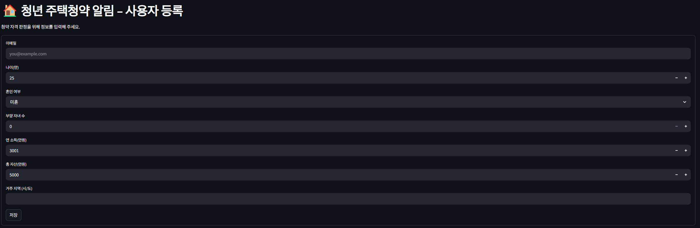
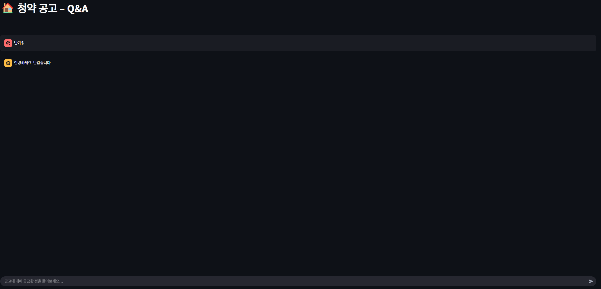

# 🏠 New Housing Drawing Notification AI

A smart notifier for youth housing applications.  
Get alerts only for the applications you're eligible for, and ask questions using GenAI (Bedrock / Upstage).

---

## 🚀 Quick Start

```bash
APP_DIR=/opt/housing-alert
git clone https://github.com/Team-Berners-Lee-AI-Hackathon/CheongCheong_Chating.git "$APP_DIR"
cd "$APP_DIR/application"

cat > .env <<'EOF'
AWS_REGION=us-east-1
BEDROCK_REGION=us-east-1
BEDROCK_MODEL_ID=us.anthropic.claude-3-7-sonnet-20250219-v1:0
S3_BUCKET=minerva-1-pdf-bucket
DYNAMO_USER_TABLE=minerva-1-user-info-table
DYNAMO_NOTICE_TABLE=minerva-1-pdf-info-table
EOF

poetry install
export PYTHONPATH=$PWD/src
poetry run streamlit run src/housing_alert/streamlit_app.py
```

---

## ⚙️ Environment Variables

Configure these via `.env` or system environment variables:

| Variable | Description |
|----------|-------------|
| `AWS_REGION` | e.g., `us-east-1` |
| `BEDROCK_REGION` | e.g., `us-east-1` |
| `BEDROCK_MODEL_ID` | e.g., `us.anthropic.claude-3-7-sonnet-20250219-v1:0` |
| `S3_BUCKET` | S3 bucket for storing PDFs |
| `DYNAMO_USER_TABLE` | DynamoDB table for users |
| `DYNAMO_NOTICE_TABLE` | DynamoDB table for notices |

> ✅ AWS credentials must be configured via `~/.aws/credentials` or environment variables.

---

## 📸 Screenshots

### User Registration  



### Housing Notice Chat (Q&A)  



---

## 🧪 Development

- DynamoDB can be replaced with local or mock resources during development.
- Housing notices (PDF) are stored in S3 after OCR.
- Claude (Bedrock) or Upstage API provides Q&A functionality.

---

## 🛠️ Tech Stack

- Python + Streamlit + Poetry
- Python + Selenium Crawling
- AWS Bedrock, S3, DynamoDB
- Upstage Document QA API
- OCR preprocessing (external service)
- Real-time notification system via email / messenger
